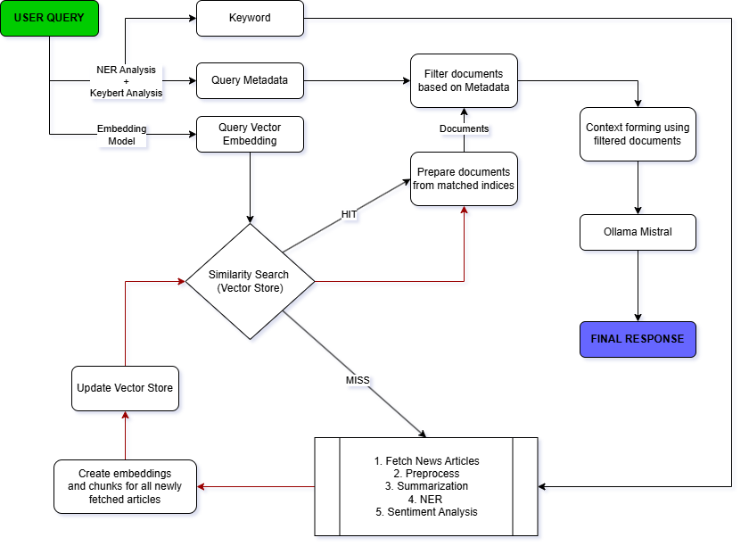

# NewsPulse

A RAG-powered news intelligence app that fetches articles on demand, understands your queries, and delivers answers enriched with sentiment analysis, named entity recognition, and summarization — all running locally via Ollama.

---

## Features

- **RAG pipeline** - Fetches live news articles via NewsAPI, embeds them into a FAISS vector store, and retrieves the most relevant chunks to answer your query
- **Sentiment analysis** - Classifies the tone of retrieved articles (positive / negative / neutral)
- **Named entity recognition (NER)** - Extracts people, organisations, locations, and events from articles
- **Summarization** - Generates concise summaries of retrieved content
- **Local LLM** - Uses Mistral via Ollama, fully offline after setup, no API key needed
- **Streamlit UI** - Clean browser-based interface, no command-line interaction required

---

## Architecture



---

## Tech Stack

| Layer | Tool |
|---|---|
| UI | Streamlit |
| News data | NewsAPI |
| Embeddings | Sentence Transformers |
| Vector store | FAISS |
| NLP | HuggingFace Transformers |
| Keyword extraction | KeyBERT |
| LLM | Mistral via Ollama |
| Language | Python 3.10+ |

---

## Prerequisites

- Python 3.10+
- [Ollama](https://ollama.ai) installed and running locally
- A [NewsAPI](https://newsapi.org) key (free tier works)

---

## Setup

**1. Clone the repository**

```bash
git clone https://github.com/your-username/newspulse.git
cd newspulse
```

**2. Install dependencies**

```bash
pip install -r requirements.txt
```

**3. Pull the Mistral model via Ollama**

```bash
ollama pull mistral
```

**4. Configure environment variables**

Create a `.env` file in the root directory:

```env
NEWS_API_KEY=your_newsapi_key_here
```

**5. Run the app**

```bash
streamlit run apps/app.py
```

Then open `http://localhost:8501` in your browser.

---

## Usage

1. Enter a topic or question in the search bar (e.g. *"What's happening with the US economy?"*)
2. NewsPulse fetches relevant articles from NewsAPI and indexes them
3. Your query is matched against the vector store to retrieve the most relevant chunks
4. The app returns:
   - A concise **insight** generated by Mistral
   - **Sentiment** breakdown of the retrieved articles
   - **Key entities** (people, organisations, places) mentioned
   - **Summaries** of the top articles

---

## Project Structure

```
newspulse/
├── apps/
│   └── app.py                # Streamlit entry point
├── assets/
│   └── architecture.png      # Flow diagram
├── scripts/
│   ├── ingest_articles/      # NewsAPI fetching and ingestion
│   ├── nlp/                  # Sentiment, NER, summarization
│   ├── pipeline/             # RAG pipeline orchestration
│   ├── preprocessing/        # Chunking, cleaning
│   ├── ui/                   # Streamlit components
│   └── utils/                # Shared helpers
├── data/
│   ├── raw/                  # Raw fetched articles
│   ├── vector_store/         # FAISS index
│   └── logs/                 # Pipeline logs
├── notebooks/                # Experimentation notebooks
├── .env                      # API keys (not committed)
├── .gitignore
└── requirements.txt
```

---

## Roadmap

- [ ] Knowledge Graph + RAG for entity-aware retrieval
- [ ] Add support for multiple LLM backends (Llama 3, Gemma)
- [ ] Topic tracking over time

---

## Author

**Gaurav Singariya**  
[LinkedIn](https://linkedin.com/in/gauravsingariya) · [GitHub](https://github.com/gaurav-S8)
